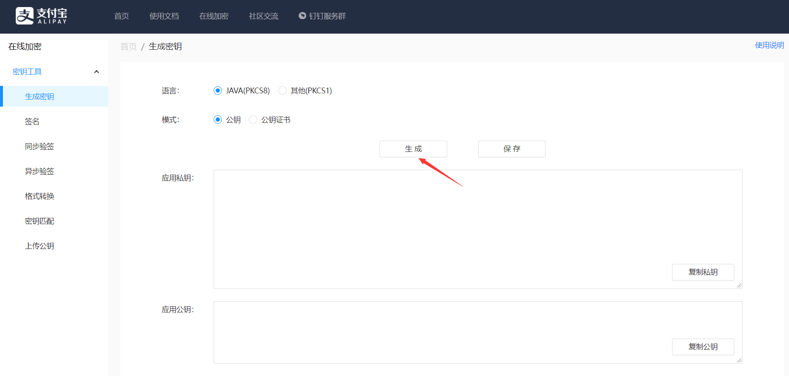

# 二手商品交易系统的设计与实现

## 需求分析

**例图**


**数据流图**

分两个（发布流程，购买流程）


### 功能性需求分析

**用户注册与登录**

为了给予用户最基本的权限

提供用户注册账号,登录账号的需求

提供用户购买服务

方便管理员区别用户,管理用户


**书籍发布与管理**

为了给予商家卖商品的权限

后台实现商品管理，前台商品展示。商家的商品种类及商品属性可以自定义，能够满足产品行业特点。


**聊天室（买卖方之间的）**

为了解决用户和商家沟通的需求

提供用户购买前想要了解商品的详情的、商品最终价格的商议、退款、以及商品售后服务的需求


**已发布书籍的查找与购买**

为了解决用户在大量商品中寻找自己想要的商品并且提供购买服务

使用户更加快捷的查找想要的商品并且购买


**评论功能**

为了解决用户购买前了解商家和商家商品的需求

提供用户写下对购买商品的意见和对商家态度的评价,方便下一位用户


### 非功能性需求分析

**交易平台提供瞬时客流量的可靠性（通过负载均衡）**


**用户头像的自定义，书籍实体图片的发布**


**权限功能：提供管理员和普通用户的不同权限**


## 概要设计

**总体设计**

(1)登录注册模块

对于一个二手商品系统而言，除了运行流畅和性能稳定之外，还必须要对数据进行保密，不允许他人进行非法访问，所以本系统需要设有登录与注册的功能。

注册的普通用户仅能使用部分功能（包括展示模块，书籍管理，我的订单，通知管理，聊天室，在线留言），管理员能够正常使用全部的用户功能，包括展示模块，书籍管理，我的订单，通知管理，聊天室，在线留言，用户管理，功能权限，角色管理。注册用户需要填写登陆名称、以及密码。


(7)个人信息查询和修改
系统能管理登录名称、密码，头像，个人历史评论，可以对个人信息进行修改，删除。


**技术架构**

Oss阿里云存储, Alipay沙箱, docker容器, k8s集群（负载均衡）, k8s检测窗

采用JavaScript+SpringBoot+MySQL技术实现。项目架设在Tomcat服务器上，开发工具采用IDEA，前端框架采用Vue.js框架，后端框架采用SpringBoot+Maven，系统选用的数据库是MySQL数据库。


**重要功能交互图**


**开发环境：**


**运行环境：**


**数据库设计**


## 详细设计

分模块设计，每个模块要有模块的功能描述、流程图或时序图、类图、模块输入、模块输出、页面跳转设计）


## 用户信息、商品信息、订单信息、购物车信息、支付信息、用户地址信息的维护


## 登录与登出功能


# 实习报告


## Alipay沙箱的实现

### 1.  密钥工具

地址：https://miniu.alipay.com/keytool/create



在线生成应用私钥`appPrivateKey`，然后点击保存并下载。


### 2.   沙箱环境

注册支付宝开发者账户，进入开发者控制台

https://openhome.alipay.com/dev/workspace


进入支付宝沙箱环境

https://open.alipay.com/platform/appDaily.htm


需要配置RSA2(SHA256)密钥


### 3.  内网穿透

内网穿透就是把本机的ip和端口暴露到外网，通过指定的url可以访问你本地的服务。

natapp地址：https://natapp.cn

启动命令：natapp.exe -authtoken=你的authtoken


### 4.  Java SDK

打开支付宝官方的文档：https://opendocs.alipay.com/open/54/00y8k9

我使用Easy版本的Java SDK集成方案

maven依赖：

```xml
<dependency>
  <groupId>com.alipay.sdk</groupId>
  <artifactId>alipay-easysdk</artifactId>
  <version>2.2.0</version>
</dependency>
```


### 5.  Alipay配置

alipay.appId：应用ID

alipay.appPrivateKey：自动生成的私钥

alipay.alipayPublicKey：根据`alipay.appPrivateKey`生成的Alipay公钥

alipay.notifyUrl：回调地址


### 6.  支付和回调接口

参照阿里支付Demo

新建一个AliPayController，写一个Get接口，这个是支付的接口。需要前端把订单的标题、订单编号、订单的总金额传到后台来，后台去调用支付宝的APi生成支付订单，在网页上实现支付。支付成功后使用隧道回调本地端口。

第二个接口是支付成功回调的接口，我们在这个接口可以获取到支付订单的订单编号和支付时间，然后我们可以修改本地订单的支付状态。注意：这是一个 POST 接口。


### 7.  前端Vue调用

在书籍的表格里，我加了个 购买的按钮用来测试支付功能。

点击购买按钮，会发生一次网络请求。请求后台的OrderController生成一个订单，并返回调用AliPayController的调用地址：

前端拿到这个地址，直接在新窗口打开即可出现支付宝的沙箱支付页面：

这里的账户和密码都是模拟的，可以在自己的沙箱账户里找到

地址：https://open.alipay.com/platform/appDaily.htm?tab=info

账户是虚拟的，可以随意充值。


### 8. 遇到的问题

#### 出现支付存在风险的警告

可能已经被系统捕捉为钓鱼网站

1. 打开一个新的浏览器，进入系统再次购买即可
2. 关闭所有网页，在浏览器更多工具里点击清除缓存，重新进入购买页面，点击购买。

然后你输入上面看到的账户密码继续就行了：

如果你上面回调接口配置的没问题，此时你的SpringBoot控制台会打印这些信息，非常详细的记录了这次交易的一些重要的参数。

```
=========支付宝异步回调========
交易名称: 碳中和革命
交易状态: TRADE_SUCCESS
支付宝交易凭证号: 2021122122001476780501972087
商户订单号: 1473215065908846592
交易金额: 60.00
买家在支付宝唯一id: 2088622957376782
买家付款时间: 2021-12-21 16:53:59
买家付款金额: 60.00
```


#### 重启后页面支付不回调

每次重启后 natapp 隧道都会重新生成新的外网地址，需要在配置文件里面及时更换，否则，无法回调

状态1表示已支付，同时设置支付的时间，在我的订单中可以看到支付信息。


#### 405 问题

请求的 Http 类型和你实际返回的 Http 类型不一致。我后台写了个 POST 接口，但是前端使用 GET 请求访问，服务器就会返回 405 的错误。所以要解决这个问题，只需要检查一下请求的方法类型是否和自己定义的方法返回类型一致即可。 

http 接口分成 3 部分

- 接口类型：例如 GET
- 接口路径：例如 /user
- 接口参数：例如 ?name=xxx 或者 /xxx


#### 接口代理问题

```vue
// 跨域配置
module.exports = {
    devServer: {                //记住，别写错了devServer//设置本地默认端口  选填
        port: 9876,
        proxy: {                 //设置代理，必须填
            '/api': {              //设置拦截器  拦截器格式   斜杠+拦截器名字，名字可以自己定
                target: 'http://localhost:9090',     //代理的目标地址
                changeOrigin: true,              //是否设置同源，输入是的
                pathRewrite: {                   //路径重写
                    '/api': ''                     //选择忽略拦截器里面的单词
                }
            }
        }
    }
}
```


## JWT权限

加入工具类 TokenUtils 生成 Token，genToken 这个方法主要是根据用户的信息生成 token 的，这个 token 里面存储了 userId，使用用户密码进行加密，默认的过期时间是 1 天。

```java
public static String genToken(User user) {
    return JWT.create().withExpiresAt(DateUtil.offsetDay(new Date(), 1)).withAudience(user.getId().toString())
            .sign(Algorithm.HMAC256(user.getPassword()));
}
```

在 UserController 的 Login 方法中使用

```java
// 生成 token 
String token = TokenUtils.genToken(res); 
res.setToken(token);
```


## 项目部署环境搭建

### Jdk

如果系统⾃带有 OpenJDK ，⾸先查找已经安装的 OpenJDK 包，再将 java 开头的安装包均卸载即可

```shell
rpm -qa | grep java
```

**卸载**

```shell
yum -y remove +openjdk包名
```


**安装**

```shell
cd /usr/local/
mkdir java
cd java
tar -zxvf /usr/local/application/jdk-8u161-linux-x64.tar.gz -C /usr/local/java/
```


**配置JDK环境变量**

编辑 `/etc/profile` ⽂件，在⽂件尾部加⼊配置

```
JAVA_HOME=/usr/local/java
CLASSPATH=$JAVA_HOME/lib/
PATH=$PATH:$JAVA_HOME/bin
export PATH JAVA_HOME CLASSPATH
```

让环境变量⽣效

```
source /etc/profile
```


**检验**

```
java -version
javac
```


方法二：不推荐但是能一步搞定

```
yum search jdk | grep openjdk
```


### MYSQL

```
tar -zxvf /usr/local/application/mysql-5.7.30-linux-glibc2.12-x86_64.tar.gz -C /usr/local/
mv mysql-5.7.30-linux-glibc2.12-x86_64/ mysql/
```

**创建MYSQL⽤户和⽤户组**

```
groupadd mysql
useradd -g mysql mysql
```

修改MYSQL目录的归属用户

```
chown -R mysql:mysql ./
```


在 `/etc` ⽬录下新建 `my.cnf`⽂件，写入以下配置

```
[mysql]
# 设置mysql客户端默认字符集
default-character-set=utf8
socket=/var/lib/mysql/mysql.sock

[mysqld]
skip-name-resolve
#设置3306端⼝
port = 3306
socket=/var/lib/mysql/mysql.sock
# 设置mysql的安装⽬录
basedir=/usr/local/mysql
# 设置mysql数据库的数据的存放⽬录
datadir=/usr/local/mysql/data
# 允许最⼤连接数
max_connections=200
# 服务端使⽤的字符集默认为8⽐特编码的latin1字符集
character-set-server=utf8
# 创建新表时将使⽤的默认存储引擎
default-storage-engine=INNODB
lower_case_table_names=1
max_allowed_packet=16M
```

使⽤如下命令创建 /var/lib/mysql目录，并修改权限

```
mkdir /var/lib/mysql
chmod 777 /var/lib/mysql
```

7 = 4 + 2 + 1    读 写 运行

5 = 4 + 1       读 运行

4 = 4          只读

**正式开始安装**

```
cd /usr/local/mysql
mkdir data
./bin/mysqld --initialize --user=mysql --basedir=/usr/local/mysql --datadir=/usr/local/mysql/data
```


**复制启动脚本到资源目录**

```
cp ./support-files/mysql.server /etc/init.d/mysqld
```


**修改 `/etc/init.d/mysqld` ，修改其 `basedir 和 datadir` 为实际对应⽬录：**

```
basedir=/usr/local/mysql
datadir=/usr/local/mysql/data
```


**设置MYSQL系统服务并开启自启**

```
chmod +x /etc/init.d/mysqld
```

同时将 mysqld 服务加⼊到系统服务

```
chkconfig --add mysqld
```

最后检查 mysqld 服务是否已经⽣效即可

```
chkconfig --list mysqld
```

在2、3、4、5运⾏级别随系统启动而自动启动，以后可以直接使 ⽤ service 命令控制 mysql 的启停。


**启动MYSQLD**

```
service mysqld start
```


**加环境变量**

编辑`~/.bash_profile`文件，在⽂件末尾处追加如下信息

```
export PATH=$PATH:/usr/local/mysql/bin
```

**重载配置文件**

```
source ~/.bash_profile
```


**登录**

```
mysql -u root -p
```


**解决：mysql: error while loading shared libraries: libncurses.so.5: cannot open shared object file: No such file or directory**

```
service mysqld stop
yum install libncurses*
service mysqld start
```


**修改ROOT账户密码**

```
alter user user() identified by "123456";
flush privileges;
```


**设置远程主机登录**

```
use mysql;
update user set user.Host='%' where user.User='root';
flush privileges;
```

连接测试通不过就开3306端口或者关虚拟机防火墙


### Nginx

**预先安装额外的依赖**

```
yum -y install pcre-devel
yum -y install openssl openssl-devel
yum -y install gcc-c++
yum -y install gcc automake autoconf libtool make
```

**编译安装NGINX**

```
tar -zxvf /usr/local/application/nginx-1.21.4.tar.gz -C /usr/local/
mv nginx-1.21.4/ nginx/
cd /usr/local/nginx/
./configure
make && make install
mkdir /usr/local/nginx/logs/
```

**启动Nginx**

```
/usr/local/nginx/sbin/nginx
```

**停止Nginx服务**

```
/usr/local/nginx/sbin/nginx -s stop
```

**重新加载Nginx**

```
/usr/local/nginx/sbin/nginx -s reload
```

**注意其配置⽂件位于：**

```
/usr/local/nginx/conf/nginx.conf
```


### Tomcat

```
tar -zxvf /usr/local/application/apache-tomcat-8.5.55.tar.gz -C /usr/local/
cd /usr/local/tomcat/bin/
./startup.sh
这时候浏览器访问： 主机IP:8080 ，得到画面说明成功启动了
```


**配置快捷操作和开机启动**

```
cd /etc/rc.d/init.d
touch tomcat
chmod +x tomcat
```

编辑 tomcat ⽂件，并在其中加⼊如下内容：

```
#!/bin/bash
#chkconfig:- 20 90
#description:tomcat
#processname:tomcat
TOMCAT_HOME=/usr/local/tomcat/
case $1 in
 start) su root $TOMCAT_HOME/bin/startup.sh;;
 stop) su root $TOMCAT_HOME/bin/shutdown.sh;;
 *) echo "require start|stop" ;;
esac
```

这样后续对于Tomcat的开启和关闭只需要执⾏如下命令即可：

```
service tomcat start
service tomcat stop
```

**加入开机启动：**

```
chkconfig --add tomcat
chkconfig tomcat on
```


Linux上启动Tomcat，结果弹出：-bash: ./startup.sh: Permission denied 的提示。

这是因为用户没有权限，而导致无法执行。用命令chmod 修改一下bin目录下的.sh权限就可以了。

```
chmod u+x *.sh
```

这里的u 这里指文件所有者，+x 添加可执行权限，*.sh表示所有的sh文件。


```shell
#!/bin/bash
#chkconfig:- 20 90
#description:tomcat
#processname:tomcat
TOMCAT_HOME=/usr/local/tomcat/apache-tomcat-9.0.54
case $1 in
 start) su root $TOMCAT_HOME/bin/startup.sh;;
 stop) su root $TOMCAT_HOME/bin/shutdown.sh;;
 *) echo "require start|stop" ;;
esac
```


conf/setting.xml?

```xml
<Context path="/" docBase="/usr/local/tomcat/apache-tomcat-9.0.54/webapps/SSM-Question" reloadable="false">
	</Context>
```


### docker

CentOS 8 中安装 docker 和 Podman 冲突，**这里是CentOS 8的安装过程**

```
1) 查看是否安装 Podman
rpm -q podman
2) 删除Podman
dnf remove podman
```

分别执行如下命令:

```bash
sudo yum install -y yum-utils  device-mapper-persistent-data  lvm2
sudo yum-config-manager  --add-repo   https://download.docker.com/linux/centos/docker-ce.repo
sudo yum install docker-ce docker-ce-cli containerd.io
sudo yum install docker-ce docker-ce-cli
```

启动docker

```sql
sudo systemctl start docker
```


**非CentOS8系统的安装过程**

```
# 下载
yum install -y docker
# 开启服务
systemctl start docker.service
```


**查看安装结果**

```
docker version
```

**设置开机自启**

```
systemctl enable docker.service
```

配置DOCKER镜像下载加速

```
# 在其中加⼊加速镜像源地址即可：
vim /etc/docker/daemon.json

{
 "registry-mirrors": ["http://hub-mirror.c.163.com"]
}
```

**重启docker**

```
systemctl daemon-reload
systemctl restart docker.service
```

查看镜像

```
docker images
```


安装可视化面板

```
docker pull portainer/portainer
docker volume create portainer_data
docker run -d --name portainer -p 9000:9000 -v /var/run/docker.sock:/var/run/docker.sock -v portainer_data:/data portainer/portainer
```


## 项目正常部署

### jar

后端打`jar`包，包在target里

```java
执行 mvn package
```


### war

后端打`war`包

`pom`里声明war

```java
<parent>
		<groupId>org.springframework.boot</groupId>
		<artifactId>spring-boot-starter-parent</artifactId>
		<version>2.5.2</version>
		<relativePath/>
</parent>
	<groupId>com.example</groupId>
	<artifactId>springboot</artifactId>
	<version>0.0.1-SNAPSHOT</version>
    <name>springboot</name>

	<!--声明war-->
	<packaging>war</packaging>
```

`pom`里加如下依赖

```java
<!--      发布时剔除内置tomcat-->
<dependency>
<groupId>org.springframework.boot</groupId>
<artifactId>spring-boot-starter-tomcat</artifactId>
<scope>provided</scope>
</dependency>
```

启动类同级目录下加新的引导类，为了主类的改造：继承初始类，重写configure方法，指向原来的启动类

```java
package com.example.demo;

public class SpringBootStarterApplication extends SpringBootServletInitializer {
    @Override
    protected SpringApplicationBuilder configure(SpringApplicationBuilder builder) {
        return builder.sources(DemoApplication.class);
    }
}
```

```java
执行 mvn package
```


前端打`dist`包，需要有node环境

打生产环境的包

```
yarn build
```

打包生成 dist文件夹，包含网页各种css样式，各种静态文件。将 `dist文件夹`压缩，上传到服务器


使用`xftp`上传包到服务器


### nginx启动dist

更改`/usr/local/nginx/conf/nginx.conf`文件

默认配置

```conf

#user  nobody;
worker_processes  1;

#error_log  logs/error.log;
#error_log  logs/error.log  notice;
#error_log  logs/error.log  info;

#pid        logs/nginx.pid;


events {
    worker_connections  1024;
}


http {
    include       mime.types;
    default_type  application/octet-stream;

    #log_format  main  '$remote_addr - $remote_user [$time_local] "$request" '
    #                  '$status $body_bytes_sent "$http_referer" '
    #                  '"$http_user_agent" "$http_x_forwarded_for"';

    #access_log  logs/access.log  main;

    sendfile        on;
    #tcp_nopush     on;

    #keepalive_timeout  0;
    keepalive_timeout  65;

    #gzip  on;

    server {
        listen       80;
        server_name  localhost;

        #charset koi8-r;

        #access_log  logs/host.access.log  main;

        location / {
            root   html;
            index  index.html index.htm;
        }

        #error_page  404              /404.html;

        # redirect server error pages to the static page /50x.html
        #
        error_page   500 502 503 504  /50x.html;
        location = /50x.html {
            root   html;
        }

        # proxy the PHP scripts to Apache listening on 127.0.0.1:80
        #
        #location ~ \.php$ {
        #    proxy_pass   http://127.0.0.1;
        #}

        # pass the PHP scripts to FastCGI server listening on 127.0.0.1:9000
        #
        #location ~ \.php$ {
        #    root           html;
        #    fastcgi_pass   127.0.0.1:9000;
        #    fastcgi_index  index.php;
        #    fastcgi_param  SCRIPT_FILENAME  /scripts$fastcgi_script_name;
        #    include        fastcgi_params;
        #}

        # deny access to .htaccess files, if Apache's document root
        # concurs with nginx's one
        #
        #location ~ /\.ht {
        #    deny  all;
        #}
    }


    # another virtual host using mix of IP-, name-, and port-based configuration
    #
    #server {
    #    listen       8000;
    #    listen       somename:8080;
    #    server_name  somename  alias  another.alias;

    #    location / {
    #        root   html;
    #        index  index.html index.htm;
    #    }
    #}


    # HTTPS server
    #
    #server {
    #    listen       443 ssl;
    #    server_name  localhost;

    #    ssl_certificate      cert.pem;
    #    ssl_certificate_key  cert.key;

    #    ssl_session_cache    shared:SSL:1m;
    #    ssl_session_timeout  5m;

    #    ssl_ciphers  HIGH:!aNULL:!MD5;
    #    ssl_prefer_server_ciphers  on;

    #    location / {
    #        root   html;
    #        index  index.html index.htm;
    #    }
    #}

}
```

更改为

```
user root;
worker_processes  1;

#pid        logs/nginx.pid;


events {
    worker_connections  1024;
}


http {
    include       mime.types;
    default_type  application/octet-stream;

    sendfile        on;

    keepalive_timeout  65;

    server {
        listen       80;
        server_name  localhost;
        location / {
            root   /usr/local/application/demo;
            index  index.html index.htm;
        }
        error_page   500 502 503 504  /50x.html;
        location = /50x.html {
            root   html;
        }
    }
}

```

重启nginx服务


```
location /prod-api/ {
            proxy_set_header Host $http_host;
            proxy_set_header X-Real-IP $remote_addr;
            proxy_set_header REMOTE-HOST $remote_addr;
            proxy_set_header X-Forwarded-For $proxy_add_x_forwarded_for;
            proxy_pass http://192.168.1.101:8080/;
        }
```


守护进程使后台运行

```java
nohup java -jar springboot-0.0.1-SNAPSHOT.jar &
```


端口查看

```
lsof -i:80
```


## docker部署

**后端部署**

拉取java8

```
docker pull java:8
```

在jar包和dist同级文件夹中

```
vi Dockerfile
```

```
FROM java:8
VOLUME /tmp
ADD springboot-0.0.1-SNAPSHOT.jar springboot-0.0.1-SNAPSHOT.jar
EXPOSE 9090
ENTRYPOINT ["java","-jar","springboot-0.0.1-SNAPSHOT.jar"]
```

打包为images

```
docker build -t springboot .
docker images
```

运行容器( -d后台运行，-p映射端口 )

```
docker run -d -p 9090:9090 --name springboot-9090 springboot
```

查看

```
docker ps
```


**前端部署**

将dist解压

在jar包和dist同级文件夹中

```
vi Dockerfile
```

```
FROM nginx:latest
COPY ./dist /usr/share/nginx/html/
EXPOSE 80
```

打包为images

```
docker build -t vue .
```

运行容器( -d后台运行，-p映射端口 )

```
docker run -d -p 80:80 --name vue-80 vue
```

查看

```
docker ps
```


